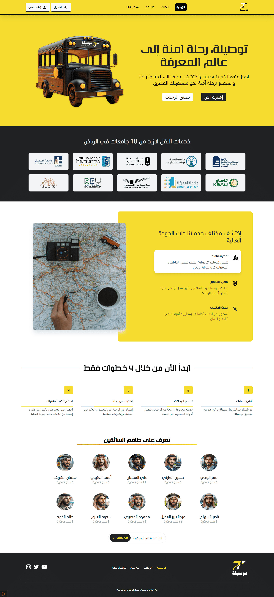
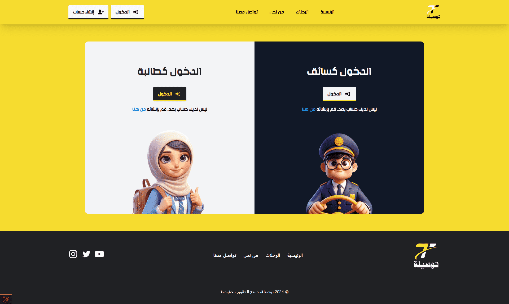
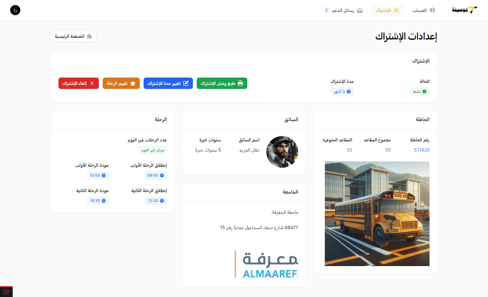
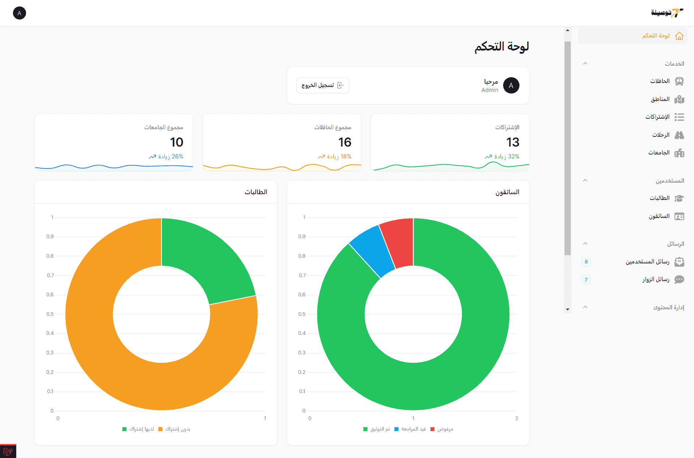

# Tawsila (توصيلة)

Tawsila is a platform built using Laravel, Filament, Tailwind CSS, and JavaScript.

It's a school bus management platform designed to streamline and organize student transportation operations.

Our platform aims to provide a safe and efficient journey for students to and from school. With features like schedule browsing, subscription management, and direct communication with admins, Tawsila ensures peace of mind for both schools and parents.

## Home Page

## Login page

## Student Dashboard

## Admin Dashboard

## Tech Stack

-   **Framework:** Laravel
-   **Admin Panel:** FilamentPHP
-   **Frontend Styling:** Tailwind CSS
-   **Frontend Interactivity:** JavaScript

## Project Structure
The Tawsila project is organized into the following main pages:

- **Home:** The landing page showcasing the vision and features of the Tawsila platform.

- **Tips:** Enables students to browse and subscribe to specific trips.

- **About Us:** Information about the project's mission, objectives, and the team behind its development.

- **Contact Us:** Contact details and a feedback form for inquiries or suggestions.

Additionally, the project incorporates three distinct panels:

- **Students Panel:** Allows students to manage their subscriptions, track bus routes, and receive notifications.

- **Drivers Panel:** Enables drivers to manage bus schedules, communicate with admins, and oversee operations.

- **Admin Panel:** Provides administrative functionalities to manage users, monitor subscriptions, and ensure the smooth operation of the platform.

## Getting Started

To run this project locally, ensure you have the following things installed: [**composer**](https://getcomposer.org/download/) , [**nodejs/npm**](https://nodejs.org/en/download), [**git**](https://git-scm.com/downloads)

## Then Follow Those Steps

1. Clone the repository: https://github.com/Mohamed-Galdi//tawsila.git

2. Navigate to the project directory: `cd tawsila`

3. Install the dependencies using Composer: `composer install --ignore-platform-reqs`

4. Create a copy of the `.env.example` file and rename it to `.env`. Configure the database settings in the `.env` file (database name).

5. Generate an application key: `php artisan key:generate`

6. Create the symbolic link: `php artisan storage:link`

7. Run the database migrations and seeders: `php artisan migrate:fresh --seed`

9. Run `npm install ` to install frontend dependencies.

10. Run `npm run dev` to compile assets.

11. Start the development server with `php artisan serve`.

12. Visit `http://127.0.0.1:8000/` in your browser to access the application.

## Login credentials
- Admin: admin@demo.com + 00000000
- Student: student@demo.com + 000000
- Driver: driver@demo.com + 000000

## Contributing

We welcome contributions to enhance the functionality, usability, or features of Tawsila Project. Feel free to fork this repository, make your changes, and submit a pull request!
